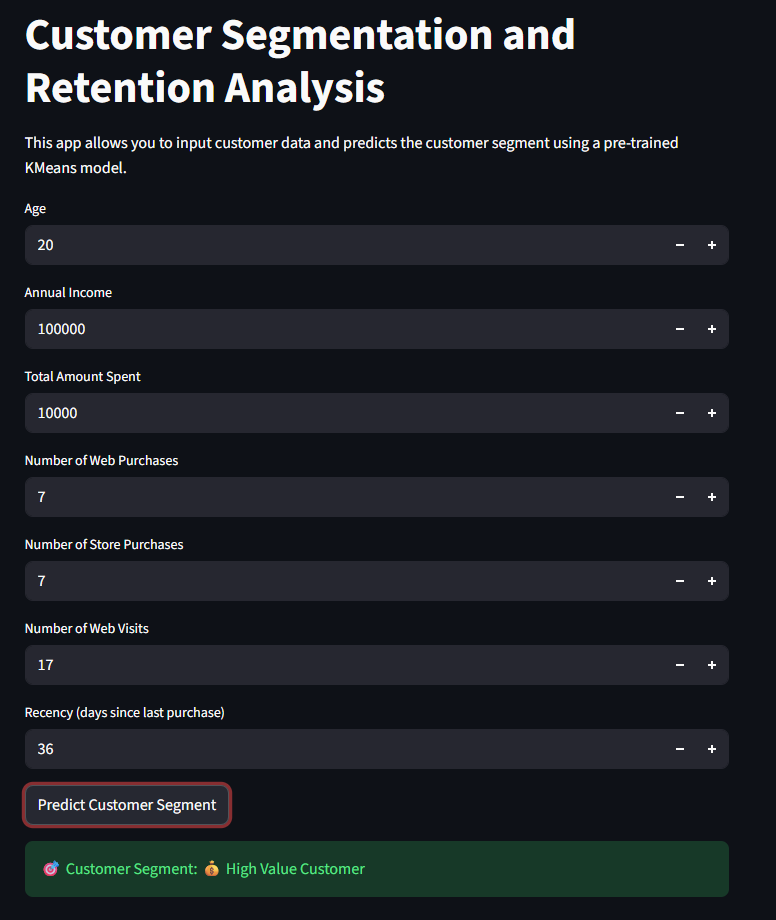

# Customer Segmentation & Retention Analysis  

## Overview  

This project delivers a **customer segmentation system using K-Means Clustering** to identify patterns in customer behavior and transactional data.  

A **Streamlit web application** enables real-time segmentation, allowing users to input customer attributes and receive instant, interpretable classifications.  

The solution converts raw data into **actionable business insights**.

---

## Key Objectives  

| Objective | Description |
|----------|------------|
| Customer Segmentation | Group customers based on behavior and spending patterns |
| Retention Improvement | Identify low-engagement users for reactivation |
| Revenue Optimization | Enable targeted marketing strategies |

---

## Business Value  

| Insight | Impact |
|--------|--------|
| High acquisition cost | Focus on retaining existing customers |
| Customer segmentation | Enables personalized marketing |
| Data-driven decisions | Improves conversion and profitability |

---

## Tech Stack  

| Category | Tools |
|---------|------|
| Programming | Python |
| Data Processing | Pandas, NumPy |
| Machine Learning | Scikit-learn (K-Means) |
| Deployment | Streamlit |
| Model Storage | Joblib |

---

## Methodology  

| Step | Description |
|-----|------------|
| Data Preprocessing | Cleaning and feature scaling |
| Model Training | K-Means clustering |
| Model Saving | Stored using `.pkl` files |
| Deployment | Integrated with Streamlit for real-time predictions |

---

## Features  

| Feature | Description |
|--------|------------|
| Interactive UI | User-friendly input interface |
| Real-time Prediction | Instant customer segmentation |
| Clean Output | Business-friendly segment labels |

---

## Customer Segments  

| Segment | Description |
|--------|------------|
| Low Value Customers | Low engagement and spending |
| Regular Customers | Moderate activity and value |
| High Value Customers | High spending and strong engagement |

---

## Application Preview  

  

---

## How to Run  

```bash
git clone https://github.com/your-username/your-repo-name.git
cd your-repo-name
pip install -r requirements.txt
streamlit run segmentation.py
```

---

## Project Structure  

```
├── segmentation.py
├── customer_segmentation_kmeans.pkl
├── customer_segmentation_scaler.pkl
├── customer_segmentation.csv
├── analysis_model.ipynb
└── README.md
```

---

## Summary  

A practical machine learning solution that transforms customer data into meaningful segments, enabling **data-driven business decisions and targeted strategies**.
